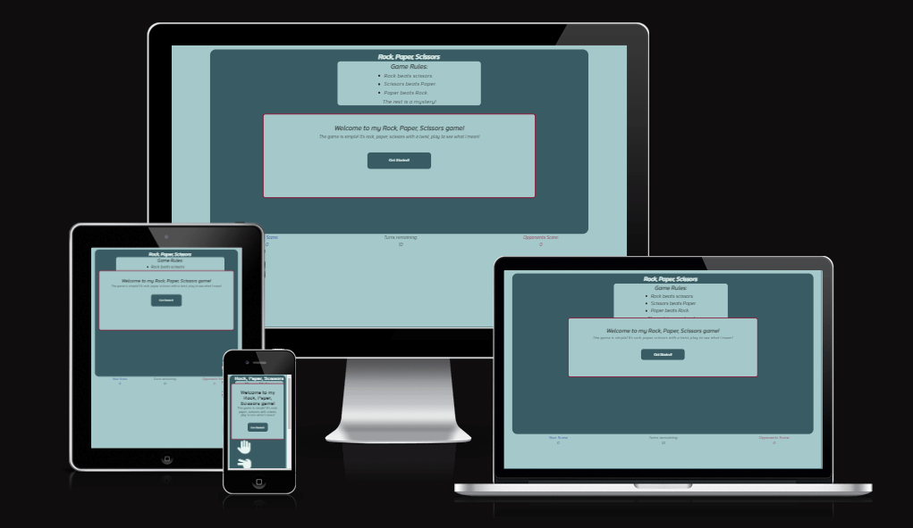
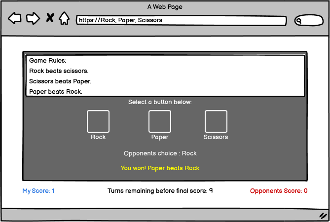
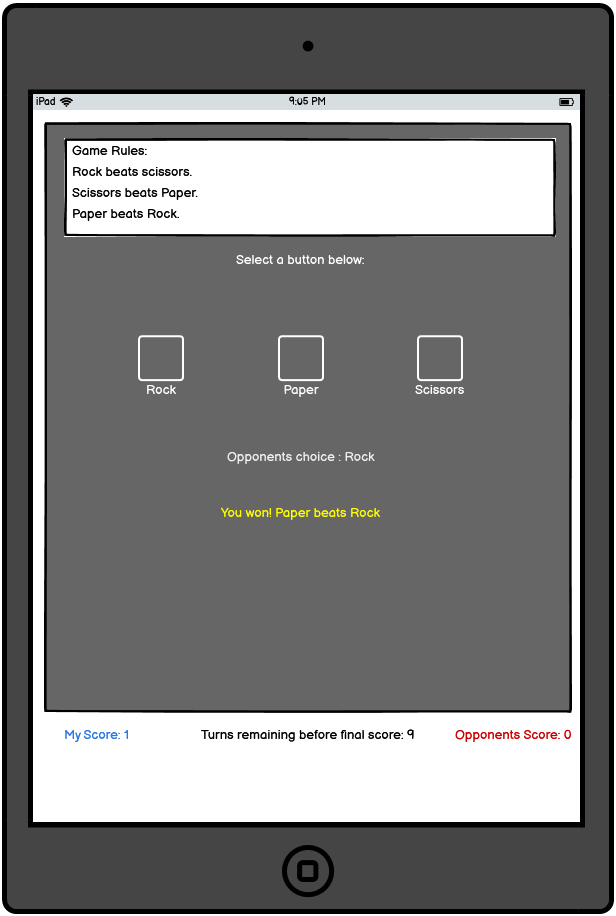
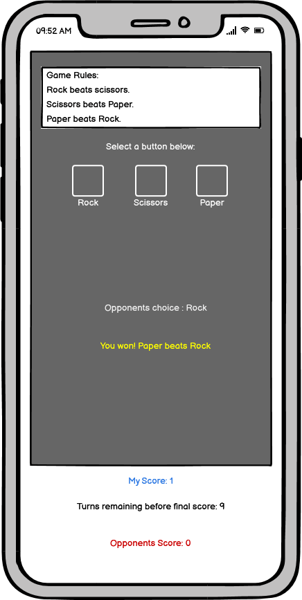
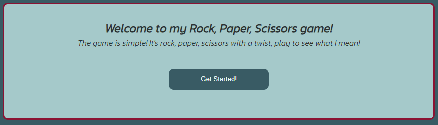
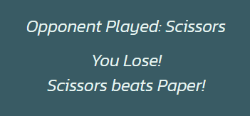
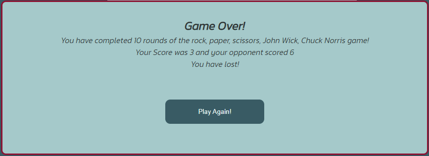
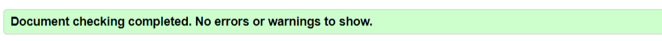
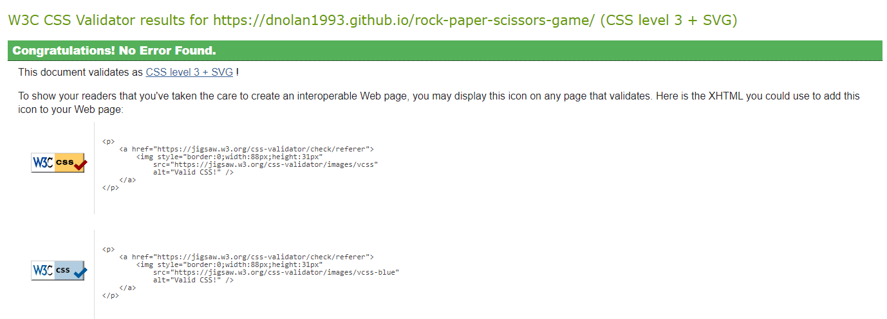

# Rock, Paper, Scissors Game

<a  href="https://dnolan1993.github.io/rock-paper-scissors-game/" target="_blank">Link to live project</a>

The Rock, Paper, Scissors Game is a webpage that contains a rock, paper, scissors game with a twist, The user can choose from rock, paper or scissors at the begining of the game, as they progress through the game, two new options will be added half way through to game to make the computers choice more unpredictable.

 

## UX
### Ideal Client
The ideal client for this page is anyone that wants to pass some time in a fun way.
#### They would ideally:
<ul>
    <li>Someone who is impulsive.</li>
    <li>Has some time to spare.</li>
    <li>Is a logical thinker.</li>
    <li>Enjoys making a decision where they can't possibly know the outcome.</li>
</ul> 

#### Goal as a first time visitor to the site:
<ul>
    <li>Understand the game.</li>
    <li>Be able to easily operate the game and its functions.</li>
    <li>Be able to see where all options are and see thier own score aswell as the opponents.</li>
</ul>

#### Goal as a returning visitor:
<ul>
    <li>Quickly be able to get straight in to the game.</li>
    <li>Be able to clearly see thier own score aswell as the opponents.</li>
</ul>

 

## Design

### Wireframes
<ul>
    <li>
        Desktop Wireframe
    </li>

    <li>
        Tablet Wireframe
    </li>

    <li>
        Phone Wireframe
    </li>

</ul>

### Colour Scheme
<ul>
    <li>
        For the colours of the webpage I went with light background overall with the counter colours different colours for each individual counter, then the background for the main-game section is a darker shade of a similar colour to the main page background, the sections within the main-game section have the same colour as the main page background. Both the icons and text within the darker background have the same light colour for contrast and all text within the lighter background have a darker colour for contrast. all chosen colours were tested for contrast using <a href="https://webaim.org/resources/contrastchecker/" target="_blank">webaim.org contrast checker</a>.
    </li>
</ul>

### Fonts
<ul>
    <li>
        For the fonts, I used <a href="https://fonts.google.com/" target="_blank">Google fonts</a>. For the entire page, I used 'Kanit' as I felt it worked well with the colour scheme, was appealing and very readable for the user.
    </li>
</ul>

### Icons
<ul>
    <li>
        For the icons I used <a href="https://fontawesome.com/" target="_blank">Font Awesome</a>. I chose the icons of hands in the positions of the symbol for rock, paper and scissors in the game as these symbols are universaly known as the symbol for these characters in the game. The two symbols for the extra characters were a man in a suit for John Wick as he wears a suit and tie in the movies, It is his signature look, And a stickman kicking for Chuck Norris as he is known best as a martial artist.
    </li>
</ul>

## Technologies Used
### Google Fonts
<ul>
    <li>
        I imported fonts from <a href="https://fonts.google.com/" target="_blank">Google fonts</a> to style the website.
    </li>
</ul>

### Font Awesome
<ul>
    <li>
        I imported icons from <a href="https://fontawesome.com/" target="_blank">Font Awesome</a> to style the website.
    </li>
</ul>

## Languages Used
<ul>
    <li>
        HTML
    </li>
    <li>
        CSS
    </li>
    <li>
        JavaScript
    </li>

## Features
### Existing Features
<ul>
 <li>
  Welcome message 
   <ul>
    <li>
     The welcome message displays a brief message to the user what the game is and that the game has a twist.
    </li>
    <li>
     When the 'Get started!' button is hovered over it enlarges showing the user they can select the button to start the game.
    </li>
    <li>
     Once the 'Get started!' button is clicked the message is removed and the user can begin to play.
    </li>
   </ul>
 </li>
</ul>

<ul>
 <li>
  Game Title 
   <ul>
    <li>
     The Game Title displays the game name at the top of the page, easily visible to the user.
    </li>
   </ul>
 </li>
</ul>

<ul>
 <li>
  Game Rules
   <ul>
    <li>
     The Game Rules section displays the basic rules of the game to the user and adds 'The rest is a mystery!' letting the user know the game has a twist.
    </li>
   </ul>
 </li>
</ul>

<ul>
 <li>
  Game Icons
   <ul>
    <li>
     The Game Icons are the buttons where the user can select which character they want to play against the opponent.
    </li>
    <li>
     When hovered over the icons enlarge to show the user clearly which character they are chosing.
    </li>
   </ul>
 </li>
</ul>

<ul>
 <li>
  Hidden Icons
   <ul>
    <li>
     The Hidden Icons are the buttons where the user can select which character they want to play against the opponent but unlike the game icons they only appear half way through the game (when user has 5 turns remaining).
    </li>
    <li>
     When hovered over the icons enlarge to show the user clearly which character they are chosing.
    </li>
   </ul>
 </li>
</ul>

<ul>
 <li>
  Game Result Display
   <ul>
    <li>
     The Game Result section diplays 'Opponent Played:' followed by the random choice of the opponent, so the user can see what choice the opponent has made.
    </li>
    <li>
     Below the 'Opponent Played:' section of the result, an outcome of 'You Win!' or 'You Lose!' is displayed depending on the choices of the players.
    </li>
    <li>
     Below the outcome a paragraph is displayed explaining the outcome e.g. 'Scissors beats Paper!'.
    </li>
   </ul>
 </li>
</ul>

<ul>
 <li>
  Score Counter Display
   <ul>
    <li>
     The Score Counter display shows 3 different counters 'Turns remaining:', 'Your Score:' and 'Opponents Score:'.
    </li>
    <li>
     All counters are displayed below the main game section.
    </li>
    <li>
     The 'Turns remaining:' counter is located in the center of the counters section and is coloured the same as the game rules section, this counter starts at '10' and decreases by one everytime the player selects a character to play.
    </li>
    <li>
     The 'Your Score:' counter is located to the left of the counter section and is coloured a dark blue colour, this colour was chosen to make the counter stand out and has been tested for contrast using the method stated above, this counter starts at '0' and increases by one everytime the player gets a 'You Win!' outcome in the game results section.
    </li>
     <li>
     The 'Opponents Score:' counter is located to the right of the counter section and is coloured a dark red colour, this colour was chosen to make the counter stand out and has been tested for contrast using the method stated above, this counter starts at '0' and increases by one everytime the player gets a 'You Lose!' outcome in the game results section.
    </li>
   </ul>
 </li>
</ul>

<ul>
 <li>
  End Of Game message 
   <ul>
    <li>
     The End Of Game message displays a brief message to the user of the outcome of the game.
    </li>
    <li>
     It states the game is over and that the user has completed 10 rounds of the game.
    </li>
    <li>
     It then states what the users final score and the opponents final score is and the outcome depending on those scores, the outcome win either be 'You have lost!' or 'Congratulations! You've Won!'.
    </li>
    <li>
     When the 'Play Again!' button is hovered over it enlarges showing the user they can select the button to re-start the game.
    </li>
    <li>
     Once the 'Play Again!' button is clicked the message is removed, the counters are reset to the original value and the user can begin to play again.
    </li>
   </ul>
 </li>
</ul>

 

### Possible Features to be Implemented in the future:
<ul>
 <li>
  A feature to allow player to connect and play against each other instead a randomly generated opponent.
 </li>
 <li>
  A counter on the end of game meassage to show the total of games played and the users wins and loses of the total games.
 </li>
 <li>
  A log in page to allow users to log in and keep track of their score and add to it.
 </li>
 <li>
  A score board page to log users high scores.
 </li>
</ul>

## Testing 
### Validator Testing
<ul>
 <li>
 <a href="https://validator.w3.org/#validate_by_uri" target="_blank">HTML Validator</a>
 </li>
  <ul>
   <li>
    index.html result
    
   </li>
  </ul>
 <li>
 <a href="https://jigsaw.w3.org/css-validator/#validate_by_uri" target="_blank">CSS Validator</a>
 </li>
  <ul>
   <li>
    style.css result
    
   </li>
  </ul>
</ul>
<li>
 <a href="https://jshint.com/" target="_blank">JavaScript Validator</a>
 </li>
  <ul>
   <li>
    script.js result (Add screenshot)
    
   </li>
  </ul>
 <li>

### Browser Testing
The site has been tested on the following browsers:

<ol>
 <li>
  Google Chrome, Version 102.0.5005.115 (Official Build) (64-bit)
 </li>
 <li>
  Firefox, Version 102.0.5005.115 (Official Build) (64-bit)
 </li>
 <li>
  Microsoft Edge, Version 102.0.1245.41 (Official build) (64-bit)
 </li>
 <li>
  Safari on iOS, version 15.4 (iPhone, iPad and iPod)(Tested on iPhone XR)
 </li>
</ol>

### Additional Testing
<ul>
 <li>
  I got friends and family to visit the site on their own devices and give me feedback on the functionality of the page and the result was they could use the game easily on their devices and all section appeared to work correctly.
 </li>
 <li>
  I confirmed my welcome message displayed when page loaded and was removed when 'Get Started!' button is clicked.
 </li>
 <li>
  I manually tested all buttons to ensure that they show the correct output when selected by the user.
 </li>
 <li>
  I Used Devtools in Google Chrome, Version 102.0.5005.115 (Official Build) (64-bit), to ensure that the elements of my page were responsive through all screen sizes and to test that the buttons still functioned as they should.
 </li>
 <li>
  I confirmed that all content of the page was easy to read and gave clear explanation of how the game worked.
 </li>
 <li>
  I confirmed my end of game message displayed when user play 10 rounds of the game and was removed and counters were reset when 'Play Again!' button is clicked.
 </li>

## UX Client Goals
### First time visitors:
<ol>
 <li>
  Understand the game.
   <ul>
    <li>
     On the Page loading the site displays a message outlining that it is a simple rock, paper, scissors game but with a twist.
    </li>
    <li>
     When 'Get Started!' is clicked the message is removed and there are game rules outlining how the game works and what character beats another.
    </li>
    <li>
     The icons used are universally understood as the motions for rock, paper and scissors, making it easy for the user to understand.
    </li>
   </ul>
 </li>
 <li>
  Be able to easily operate the game and its functions.
  <ul>
   <li>
    All buttons enlarge when hovered over to make it clear to the user which button is in use and which icons can be used.
   </li>
   <li>
    The user simply has to click their selected icon and that will select the icon chosen by the user.
   </li>
  </ul>
 </li>
 <li>
  Be able to see where all options are and see thier own score aswell as the opponents.
  <ul>
   <li>
    The options are very clear and are presented using large icons that enlarge when hovered over, making them easily visible and usable for the user.
   </li>
   <li>
    The score and turns remaining counters are clearly displayed at the bottom of the page below the main game section.
   </li>
  </ul>
 </li>
</ol>

### Returning visitors:
<ol>
 <li>
  Quickly be able to get straight in to the game.
   <ul> 
    <li>
     When 'Get Started!' is clicked the message is removed and the user can get straight in to the game.
    </li>
    <li>
     When the end of game message is diplayed the user only has to click the 'Play Again!' and the user is ready to play again. 
    </li>
   </ul>
 </li>
 <li>
  Be able to clearly see thier own score aswell as the opponents.
  <ul>
   <li>
    All score counters are displayed at the bottom of the page, making it easy for the user to see their score, their opponents score and turns remaining.
   </li>
  </ul>
 </li>
</ol>

## Funtionality Testing
<ol>
 <li>
   Welcome message
    <ul>
     <li>
      <a href="https://dnolan1993.github.io/rock-paper-scissors-game/">Load Game page</a> in web browser.
     </li>
     <li>
      Ensure that the welcome message is display on load of webpage.
     </li>
     <li>
      Use devtools to adjust screen sizes up and down to verify that the welcome message and its positioning are responsive.
     </li>
    </ul>
  </li>
  <li>
   Welcome message 'Get Started!' button
    <ul>
     <li>
     Click the 'Get Started!' button in the welcome message to verify it removes the welcome message to allow the user to clearly view the game page.
     </li>
     <li>
      Use devtools to adjust screen sizes up and down to verify that the 'Get Started!' button and its positioning are responsive.
     </li>
    </ul>
  </li>
  <li>
   Entire page responsiveness
   <ul>
    <li>
     Use devtools to adjust screen sizes up and down to verify that the page and elements positioning are responsive.
    </li>
   </ul>
  </li>
  <li>
   Game Icons
    <ul>
     <li>
      Hover over each icon to verify that they enlarge individually as hovered over.
     </li>
     <li>
      Click each icon to ensure that it select the correct outcome for the selection of the icon.
     </li>
     <li>
      Use devtools to adjust screen sizes up and down to verify that the game icons and their positioning are responsive.
     </li>
   </ul>
  </li>
  <li>
   Hidden Icons
    <ul>
     <li>
      Play the game until 'Turns remaining' counter reaches 5 to ensure the icon display when intended.
     </li>
     <li>
      Hover over each icon to verify that they enlarge individually as hovered over.
     </li>
     <li>
      Click each icon to ensure that it select the correct outcome for the selection of the icon.
     </li>
     <li>
      Complete the game and click the 'Play Again!' button to verify that the buttons are removed as intended.
     </li>
     <li>
      Use devtools to adjust screen sizes up and down to verify that the hidden icons and their positioning are responsive.
     </li>
   </ul>
  </li>
  <li>
   Result display
    <ul>
     <li>
      Play the game a number of times to ensure that the opponents choice is random and chooses a different character.
     </li>
     <li>
      Play the game a number of times to ensure that the result is the correct value 'You Win!' or 'You Lose!' depending on the characters chosen.
     </li>
     <li>
      Play the game a number of times to ensure that text displayed is correct depending on the characters chosen, showing the correct information e.g. 'Rock beats Scissors'.
     </li>
     <li>
      Use devtools to adjust screen sizes up and down to verify that the result display and its positioning are responsive.
     </li>
   </ul>
  </li>
  <li>
   Score counters
    <ul>
     <li>
      Ensure that counters have the correct value on page load, 'Your Score:0', 'Turns remaining:10' and 'Opponents Score:0'.
     </li>
     <li>
      Play the game a number of times to ensure the 'Your Score:' counter increases by 1 each time a 'You Win!' outcome is displayed.
     </li>
     <li>
      Play the game a number of times to ensure the 'Turns remaining:' counter reduces by 1 each time a character is played.
     </li>
     <li>
      Play the game a number of times to ensure the 'Opponents Score:' counter increases by 1 each time a 'You Lose!' outcome is displayed.
     </li>
    </ul>
  </li>
  <li>
   End of Game message
   <ul>
    <li>
     Play the game until the 'Turns remaining:' counter has a value of 0 to ensure that the end of game message is displayed when intended. 
    </li>
    <li>
     Ensure that the end of game is showing the current infornmation, your score, opponents score and the overall outcome. Perform this step multiple times to ensure consistency.
    </li>
    <li>
     Click 'Play Again!' button to ensure it removes the end of game message, resets counters and removes hidden icons as intended.
    </li>
    <li>
     Play the game until 'Turns remaining' counter reaches 5 again to ensure the hidden icon display again when intended.
    </li>
   </ul>
  </li>
</ol>
