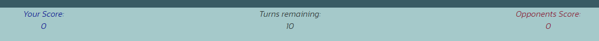

# Rock, Paper, Scissors Game

<a  href="https://dnolan1993.github.io/rock-paper-scissors-game/" target="_blank">Link to live project</a>

The Rock, Paper, Scissors Game is a webpage that contains a rock, paper, scissors game with a twist, The user can choose from rock, paper or scissors at the begining of the game, as they progress through the game, two new options will be added half way through to game to make the computers choice more unpredictable.

 

## UX
### Ideal Client
The ideal client for this page is anyone that wants to pass some time in a fun way.
#### They would ideally:
<ul>
    <li>Someone who is impulsive.</li>
    <li>Has some time to spare.</li>
    <li>Is a logical thinker.</li>
    <li>Enjoys making a decision where they can't possibly know the outcome.</li>
</ul> 

#### Goal as a first time visitor to the site:
<ul>
    <li>Understand the game.</li>
    <li>Be able to easily operate the game and its functions.</li>
    <li>Be able to see where all options are and see thier own score aswell as the opponents.</li>
</ul>

#### Goal as a returning visitor:
<ul>
    <li>Quickly be able to get straight in to the game.</li>
    <li>Be able to clearly see thier own score aswell as the opponents.</li>
</ul>

 

## Design

### Wireframes
<ul>
    <li>
        Desktop Wireframe
    </li>

    <li>
        Tablet Wireframe
    </li>

    <li>
        Phone Wireframe
    </li>

</ul>

### Colour Scheme
<ul>
    <li>
        For the colours of the webpage I went with light background overall with the counter colours different colours for each individual counter, then the background for the main-game section is a darker shade of a similar colour to the main page background, the sections within the main-game section have the same colour as the main page background. Both the icons and text within the darker background have the same light colour for contrast and all text within the lighter background have a darker colour for contrast. all chosen colours were tested for contrast using <a href="https://webaim.org/resources/contrastchecker/" target="_blank">webaim.org contrast checker</a>.
    </li>
</ul>

### Fonts
<ul>
    <li>
        For the fonts, I used <a href="https://fonts.google.com/" target="_blank">Google fonts</a>. For the entire page, I used 'Kanit' as I felt it worked well with the colour scheme, was appealing and very readable for the user.
    </li>
</ul>

### Icons
<ul>
    <li>
        For the icons I used <a href="https://fontawesome.com/" target="_blank">Font Awesome</a>. I chose the icons of hands in the positions of the symbol for rock, paper and scissors in the game as these symbols are universaly known as the symbol for these characters in the game. The two symbols for the extra characters were a man in a suit for John Wick as he wears a suit and tie in the movies, It is his signature look, And a stickman kicking for Chuck Norris as he is known best as a martial artist.
    </li>
</ul>

## Technologies Used
### Google Fonts
<ul>
    <li>
        I imported fonts from <a href="https://fonts.google.com/" target="_blank">Google fonts</a> to style the website.
    </li>
</ul>

### Font Awesome
<ul>
    <li>
        I imported icons from <a href="https://fontawesome.com/" target="_blank">Font Awesome</a> to style the website.
    </li>
</ul>

## Languages Used
<ul>
    <li>
        HTML
    </li>
    <li>
        CSS
    </li>
    <li>
        JavaScript
    </li>

## Features
### Existing Features
<ul>
 <li>
  Welcome message 
   <ul>
    <li>
     The welcome message displays a brief message to the user what the game is and that the game has a twist.
    </li>
    <li>
     When the 'Get started!' button is hovered over it enlarges showing the user they can select the button to start the game.
    </li>
    <li>
     Once the 'Get started!' button is clicked the message is removed and the user can begin to play.
    </li>
   </ul>
 </li>
</ul>

<ul>
 <li>
  Game Title 
   <ul>
    <li>
     The Game Title displays the game name at the top of the page, easily visible to the user.
    </li>
   </ul>
 </li>
</ul>

<ul>
 <li>
  Game Rules
   <ul>
    <li>
     The Game Rules section displays the basic rules of the game to the user and adds 'The rest is a mystery!' letting the user know the game has a twist.
    </li>
   </ul>
 </li>
</ul>

<ul>
 <li>
  Game Icons
   <ul>
    <li>
     The Game Icons are the buttons where the user can select which character they want to play against the opponent.
    </li>
    <li>
     When hovered over the icons enlarge to show the user clearly which character they are chosing.
    </li>
   </ul>
 </li>
</ul>

<ul>
 <li>
  Hidden Icons
   <ul>
    <li>
     The Hidden Icons are the buttons where the user can select which character they want to play against the opponent but unlike the game icons they only appear half way through the game (when user has 5 turns remaining).
    </li>
    <li>
     When hovered over the icons enlarge to show the user clearly which character they are chosing.
    </li>
   </ul>
 </li>
</ul>

<ul>
 <li>
  Game Result Display
   <ul>
    <li>
     The Game Result section diplays 'Opponent Played:' followed by the random choice of the opponent, so the user can see what choice the opponent has made.
    </li>
    <li>
     Below the 'Opponent Played:' section of the result, an outcome of 'You Win!' or 'You Lose!' is displayed depending on the choices of the players.
    </li>
    <li>
     Below the outcome a paragraph is displayed explaining the outcome e.g. 'Scissors beats Paper!'.
    </li>
   </ul>
 </li>
</ul>

<ul>
 <li>
  Score Counter Display
   <ul>
    <li>
     The Score Counter display shows 3 different counters 'Turns remaining:', 'Your Score:' and 'Opponents Score:'.
    </li>
    <li>
     All counters are displayed below the main game section.
    </li>
    <li>
     The 'Turns remaining:' counter is located in the center of the counters section and is coloured the same as the game rules section, this counter starts at '10' and decreases by one everytime the player selects a character to play.
    </li>
    <li>
     The 'Your Score:' counter is located to the left of the counter section and is coloured a dark blue colour, this colour was chosen to make the counter stand out and has been tested for contrast using the method stated above, this counter starts at '0' and increases by one everytime the player gets a 'You Win!' outcome in the game results section.
    </li>
     <li>
     The 'Opponents Score:' counter is located to the right of the counter section and is coloured a dark red colour, this colour was chosen to make the counter stand out and has been tested for contrast using the method stated above, this counter starts at '0' and increases by one everytime the player gets a 'You Lose!' outcome in the game results section.
    </li>
   </ul>
 </li>
</ul>
